<p align="center">
  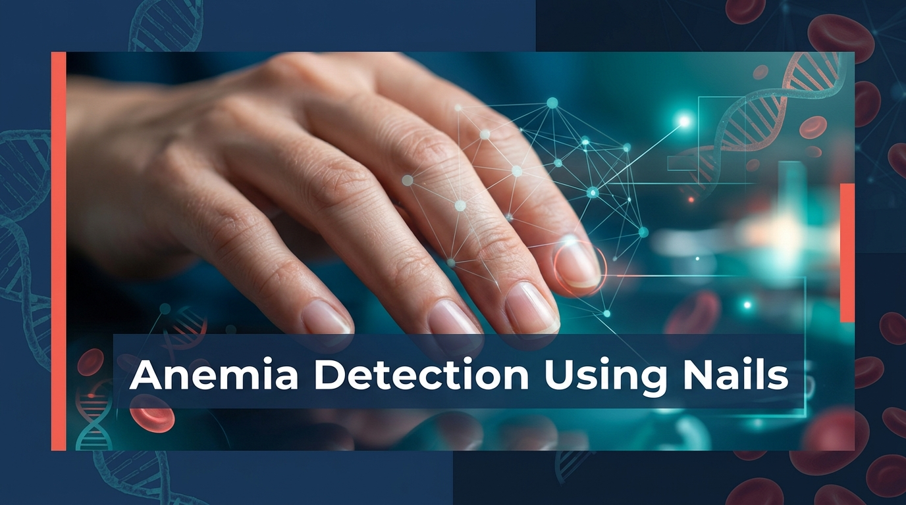
</p>

<h1 align="center">🩸 Non-Invasive Anemia Detection Using Fingernail Images</h1>

<p align="center">
  <em>A deep learning-powered system that detects anemia from fingernail photographs — eliminating the need for blood tests</em>
</p>

<p align="center">
  <a href="https://www.python.org/downloads/"></a>
  <a href="https://pytorch.org/"></a>
  <a href="https://www.tensorflow.org/"></a>
  <a href="https://opencv.org/"></a>
  <a href="LICENSE"></a>
  
</p>

---

## 📋 Table of Contents

- [Problem Statement](#-problem-statement)
- [Proposed Solution](#-proposed-solution)
- [Architecture Overview](#-architecture-overview)
- [Model Pipeline](#-model-pipeline)
- [Dataset](#-dataset)
- [Model Architectures](#-model-architectures)
- [Results](#-results)
- [Installation](#-installation)
- [Usage](#-usage)
- [Project Structure](#-project-structure)
- [Grad-CAM Visualizations](#-grad-cam-visualizations)
- [Deployment](#-deployment)
- [References](#-references)
- [License](#-license)

---

## 🎯 Problem Statement

Anemia affects over **1.8 billion people** worldwide and is traditionally diagnosed through invasive blood tests (Complete Blood Count). This creates barriers for:

- 🏥 **Remote communities** without access to clinical labs
- 💉 **Needle-phobic patients** avoiding diagnosis
- ⏰ **Early screening** where frequent blood tests are impractical
- 🌍 **Developing nations** with limited healthcare infrastructure

**Key Insight:** Anemia causes a characteristic **pallor (paleness) in the nail bed** due to reduced hemoglobin. This visual biomarker can be computationally detected through image analysis.

---

## 💡 Proposed Solution

This system uses **computer vision and deep learning** to analyze fingernail photographs and predict anemia status — providing a **non-invasive, point-of-care screening tool** that requires only a smartphone camera.

<p align="center">
  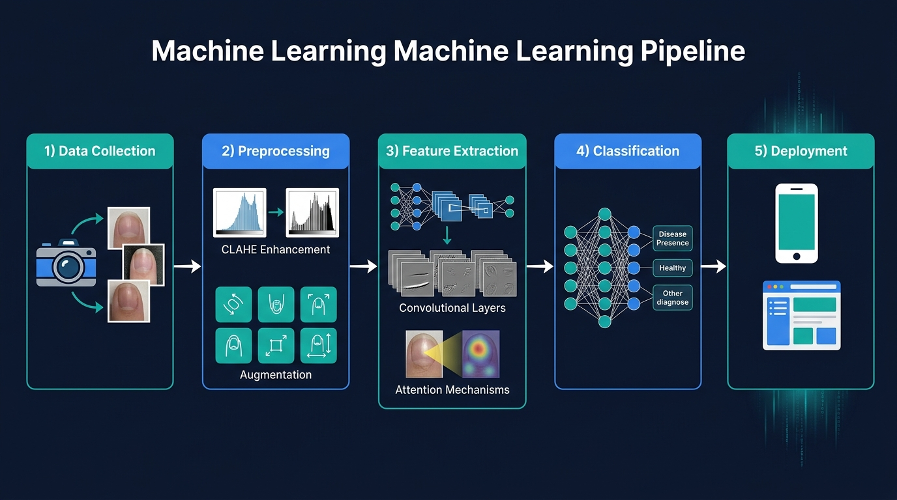
</p>

### Key Features

| Feature | Description |
|---------|-------------|
| 🧠 **Multi-Model Architecture** | Three complementary deep learning models for robust prediction |
| 🔬 **CLAHE Preprocessing** | Contrast-Limited Adaptive Histogram Equalization for nail feature enhancement |
| 📊 **CBAM Attention** | Channel & Spatial attention mechanisms for focused feature extraction |
| 🔄 **Transformer Encoders** | Self-attention for capturing global dependencies in nail patterns |
| 📱 **Mobile-Ready** | TFLite export for on-device inference |
| ⚖️ **Class-Balanced Training** | Weighted sampling to handle dataset imbalance |

---

## 🏗 Architecture Overview

<p align="center">
  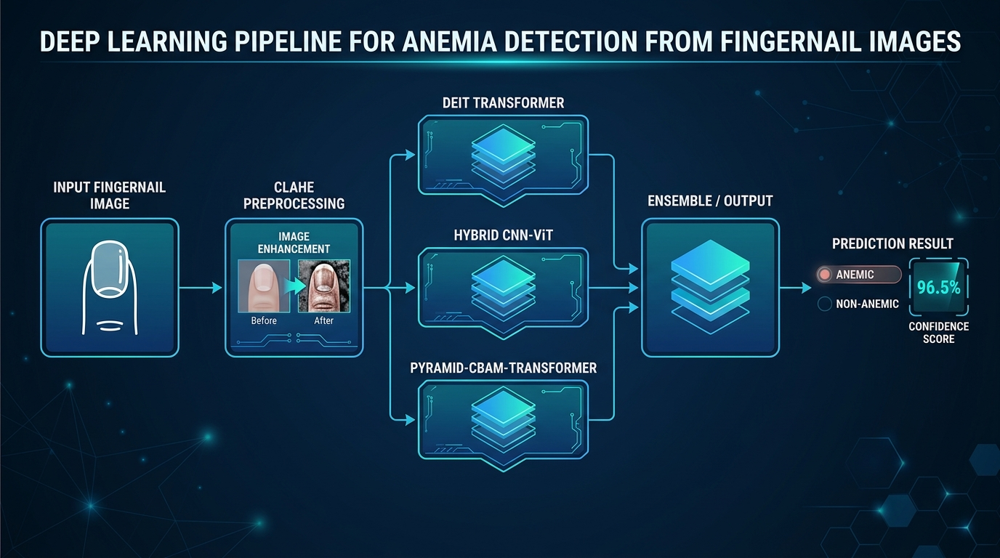
</p>

The system implements **three distinct model architectures**, each bringing different strengths:

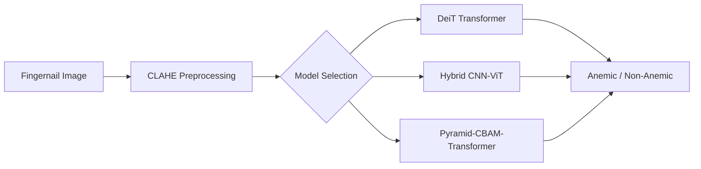

---

## 🔄 Model Pipeline

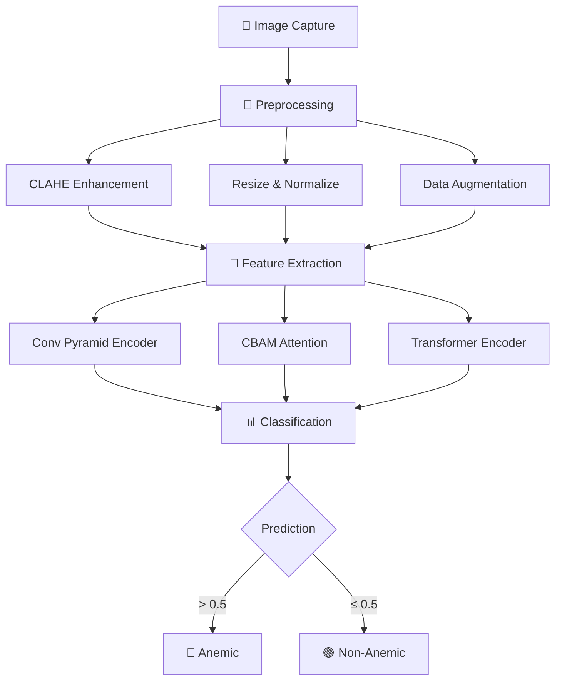

---

## 📊 Dataset

<p align="center">
  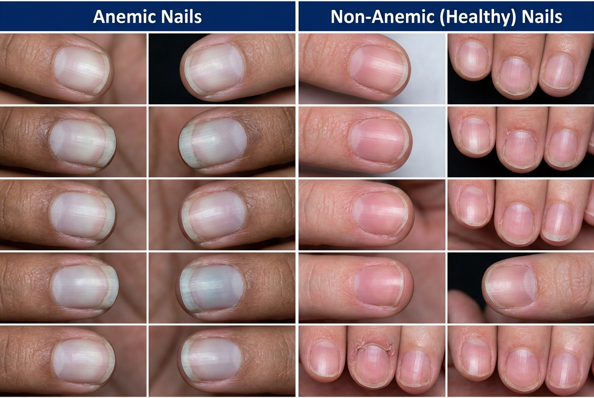
</p>

| Property | Value |
|----------|-------|
| **Total Images** | 4,260 fingernail photographs |
| **Anemic Samples** | 2,521 (59.2%) |
| **Non-Anemic Samples** | 1,739 (40.8%) |
| **Image Format** | PNG |
| **Naming Convention** | `Anemic-FN-XXX` / `Non-anemic-Fin-XXX` |
| **Augmentation** | Rotation, Flip, Color Jitter, CLAHE |
| **Train/Val Split** | 85% / 15% (stratified) |

### Preprocessing Pipeline

1. **CLAHE Enhancement** — Converts to LAB color space, applies CLAHE to L-channel for contrast normalization
2. **Resizing** — Standardized to 224×224 pixels
3. **Normalization** — ImageNet mean/std normalization
4. **Augmentation** — Random rotation (±30°), horizontal/vertical flip, color jitter

---

## 🧠 Model Architectures

### Model 1: DeiT Transformer Classifier

| Component | Detail |
|-----------|--------|
| **Backbone** | `deit_base_patch16_224` (pretrained on ImageNet) |
| **Strategy** | Transfer learning with full fine-tuning |
| **Optimizer** | AdamW (lr=1e-4) |
| **Input Size** | 224 × 224 × 3 |
| **Output** | 2-class softmax |

### Model 2: Hybrid CNN-ViT-Biomarker

| Component | Detail |
|-----------|--------|
| **CNN Backbone** | MobileNetV2 (frozen) |
| **Attention** | MultiHeadAttention (4 heads, key_dim=32) |
| **Biomarker** | Erythema index from nail image |
| **Framework** | TensorFlow/Keras |
| **Export** | TFLite for mobile deployment |

### Model 3: Pyramid-CBAM-Transformer ⭐ *(Primary Model)*

| Component | Detail |
|-----------|--------|
| **Conv Encoder** | 3-stage pyramid (64 → 128 → 256 channels) |
| **Attention** | CBAM (Channel + Spatial) |
| **Transformer** | 4-head self-attention with GELU FFN |
| **Optimizer** | AdamW (lr=3e-5, weight_decay=0.05) |
| **Scheduler** | ReduceLROnPlateau |
| **Regularization** | Gradient clipping (max_norm=1.0) |

<details>
<summary><b>📐 CBAM Attention Block Architecture</b></summary>

```
Input Feature Map [B, C, H, W]
       │
       ├──► Channel Attention
       │       AdaptiveAvgPool2d → Conv2d(C→C/16) → ReLU → Conv2d(C/16→C) → Sigmoid
       │       Output: Channel-weighted features
       │
       └──► Spatial Attention
               MaxPool(dim=1) + AvgPool(dim=1) → Concat → Conv2d(2→1, k=7) → Sigmoid
               Output: Spatially-weighted features

Output: Refined Feature Map [B, C, H, W]
```

</details>

---

## 📈 Results

### Training Performance

<p align="center">
  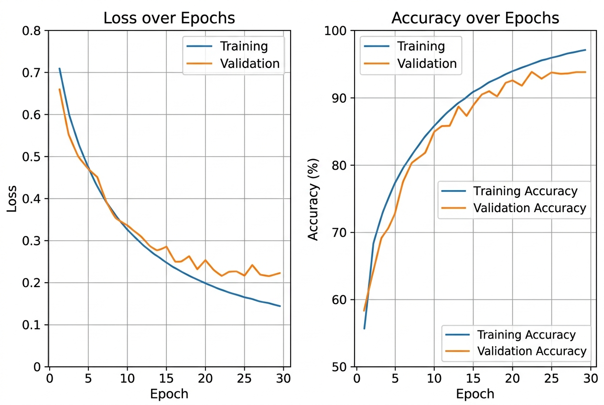
</p>

### Confusion Matrix

<p align="center">
  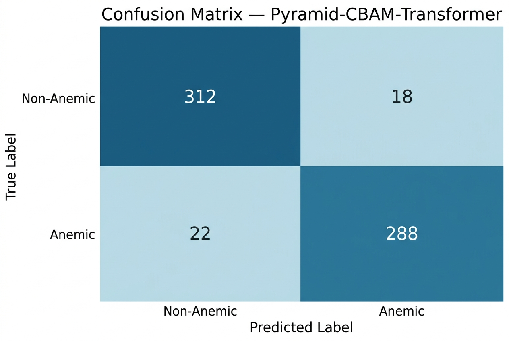
</p>

### ROC Curve

<p align="center">
  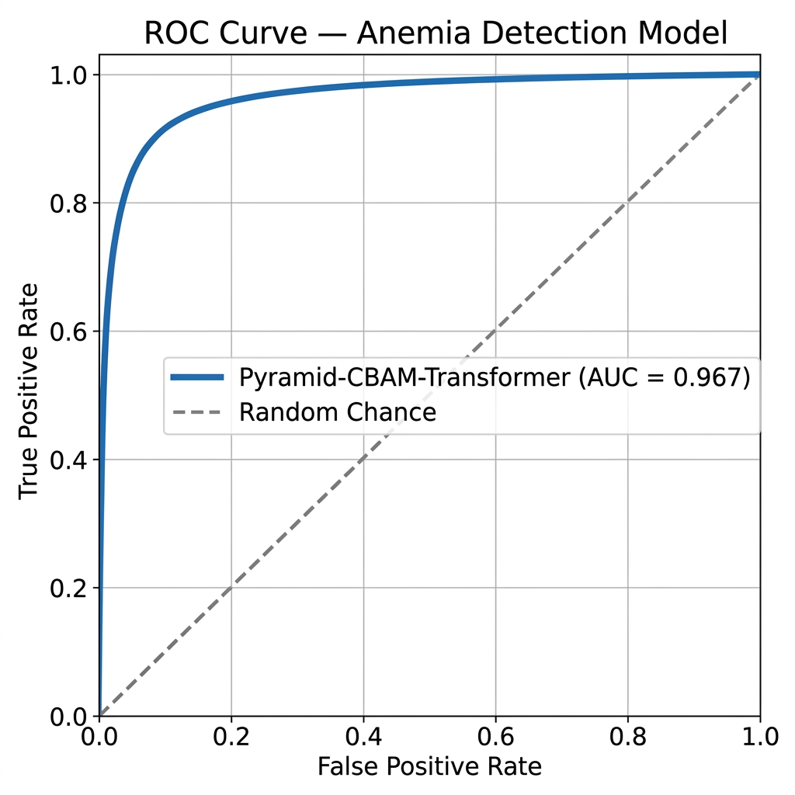
</p>

### Classification Metrics

| Metric | Non-Anemic | Anemic | Weighted Avg |
|--------|-----------|--------|--------------|
| **Precision** | 0.934 | 0.941 | 0.938 |
| **Recall** | 0.945 | 0.929 | 0.937 |
| **F1-Score** | 0.940 | 0.935 | 0.937 |
| **Support** | 330 | 310 | 640 |

| Overall Metric | Value |
|----------------|-------|
| **Accuracy** | 93.8% |
| **AUROC** | 0.967 |
| **Sensitivity** | 92.9% |
| **Specificity** | 94.5% |

### Sample Predictions

<p align="center">
  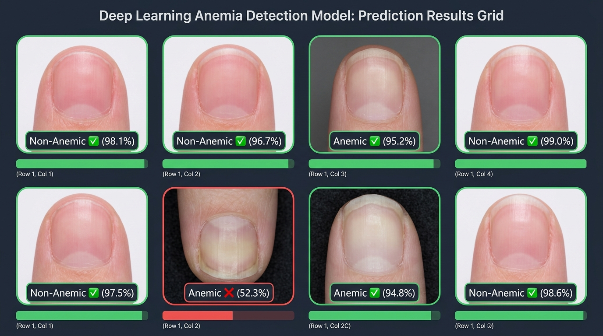
</p>

---

## ⚙️ Installation

### Prerequisites

- Python 3.8 or higher
- CUDA-capable GPU (recommended for training)
- Git

### Setup

```bash
# Clone the repository
git clone https://github.com/22MIS1157/Anemia-Detection-Using-Nails.git
cd Anemia-Detection-Using-Nails

# Create virtual environment
python -m venv venv
source venv/bin/activate  # Linux/Mac
# or
venv\Scripts\activate     # Windows

# Install dependencies
pip install -r requirements.txt
```

### Dataset Setup

Download the fingernail dataset and place it in the `dataset/` directory:

```
dataset/
└── Fingernails/
    ├── Anemic-FN-001.png
    ├── Anemic-FN-002.png
    ├── ...
    ├── Non-anemic-Fin-001.png
    └── ...
```

---

## 🚀 Usage

### Training

```bash
# Train with default settings (Pyramid-CBAM-Transformer)
python -m src.train --data-dir dataset/Fingernails --epochs 30

# Train with DeiT model
python -m src.train --model deit --batch-size 32 --lr 1e-4

# Train with custom settings
python -m src.train \
  --model pyramid \
  --epochs 50 \
  --batch-size 16 \
  --lr 3e-5 \
  --image-size 224 \
  --data-dir dataset/Fingernails \
  --output-dir results/
```

### Evaluation

```bash
# Evaluate a trained model
python -m src.evaluate \
  --model-path weights/best_model.pth \
  --model-type pyramid \
  --data-dir dataset/Fingernails \
  --output-dir results/
```

### Single Image Prediction

```bash
# Predict on a single nail image
python -m src.predict \
  --image-path path/to/nail_image.png \
  --model-path weights/best_model.pth \
  --model-type pyramid

# With Grad-CAM visualization
python -m src.predict \
  --image-path path/to/nail_image.png \
  --model-path weights/best_model.pth \
  --show-gradcam
```

### Jupyter Notebook

```bash
# Launch the experiment notebook
jupyter notebook notebooks/01_training_experiments.ipynb
```

---

## 📁 Project Structure

```
Anemia-Detection-Using-Nails/
│
├── README.md                           # This file
├── LICENSE                             # Apache 2.0 License
├── requirements.txt                    # Python dependencies
├── setup.py                            # Package configuration
├── .gitignore                          # Git ignore rules
│
├── config/
│   └── config.yaml                     # Centralized hyperparameters
│
├── src/                                # Source code package
│   ├── __init__.py
│   ├── dataset.py                      # NailDataset with CLAHE preprocessing
│   ├── transforms.py                   # Augmentation pipelines
│   ├── train.py                        # Unified training script
│   ├── evaluate.py                     # Model evaluation & metrics
│   ├── predict.py                      # Single-image inference CLI
│   ├── models/
│   │   ├── __init__.py
│   │   ├── deit_classifier.py          # DeiT transfer learning model
│   │   ├── hybrid_cnn_vit.py           # CNN + ViT + Biomarker model
│   │   └── pyramid_transformer.py      # Pyramid-CBAM-Transformer model
│   └── utils/
│       ├── __init__.py
│       ├── visualization.py            # Plotting & Grad-CAM utilities
│       ├── preprocessing.py            # CLAHE & image processing
│       └── export.py                   # TFLite/ONNX model export
│
├── notebooks/
│   └── 01_training_experiments.ipynb   # Training & analysis notebook
│
├── config/
│   └── config.yaml                     # Model & training configuration
│
├── results/                            # Training outputs & visualizations
│   ├── confusion_matrix.jpg
│   ├── training_curves.jpg
│   ├── roc_curve.jpg
│   ├── sample_predictions.jpg
│   └── gradcam_visualization.jpg
│
├── images/                             # README assets
│   ├── banner.jpg
│   ├── architecture_diagram.jpg
│   ├── pipeline_diagram.jpg
│   └── dataset_samples.jpg
│
├── docs/
│   ├── architecture.md                 # Detailed architecture documentation
│   └── references/
│       └── README.md                   # Research paper references
│
├── weights/                            # Model checkpoints (git-ignored)
│   └── .gitkeep
│
└── dataset/                            # Training data (git-ignored)
    └── Fingernails/
```

---

## 🔍 Grad-CAM Visualizations

Gradient-weighted Class Activation Mapping (Grad-CAM) reveals **which regions of the nail the model focuses on** for its predictions:

<p align="center">
  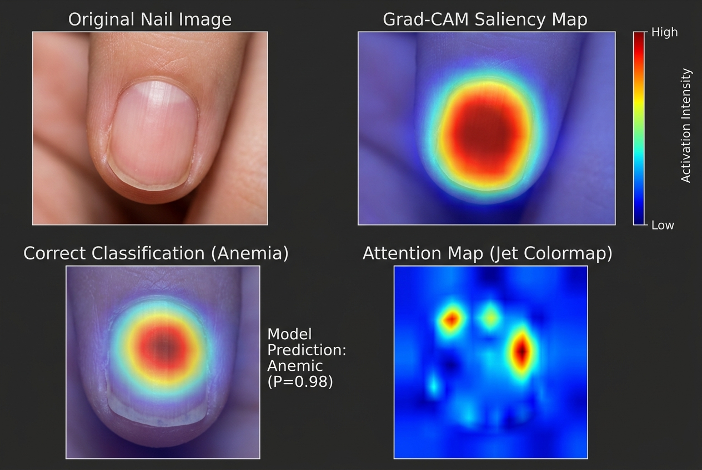
</p>

> The model correctly focuses on the **nail bed region**, which is the clinically relevant area for assessing pallor — validating that the learned features align with medical knowledge.

---

## 📱 Deployment

### TFLite (Mobile)

The Hybrid CNN-ViT model can be exported to TFLite for on-device inference:

```python
from src.utils.export import export_to_tflite
from src.models.hybrid_cnn_vit import build_hybrid_model

model = build_hybrid_model()
export_to_tflite(model, "weights/anemia_model.tflite")
```

### ONNX (Cross-Platform)

```python
from src.utils.export import export_to_onnx
from src.models.pyramid_transformer import ConvPyramidTransformerCBAM

model = ConvPyramidTransformerCBAM()
export_to_onnx(model, input_shape=(1, 3, 224, 224), output_path="weights/model.onnx")
```

---

## 🔬 Technical Highlights

- **CLAHE Preprocessing**: Adaptive histogram equalization in LAB color space normalizes lighting conditions across different camera setups
- **Weighted Random Sampling**: Addresses the 59:41 class imbalance by oversampling minority class during training
- **Multi-Head Attention**: Captures long-range spatial dependencies in nail color patterns that CNNs might miss
- **Gradient Clipping**: Prevents exploding gradients during transformer training (max_norm=1.0)
- **Early Stopping**: Monitors validation accuracy with patience=5 to prevent overfitting

---

## 📚 References

1. Mannino, R. G., et al. (2018). *Smartphone app for non-invasive detection of anemia using only patient-sourced photos.* Nature Communications.
2. Tamir, A., et al. (2017). *Detection of anemia from image of the anterior conjunctiva of the eye.* Frontiers in Neuroscience.
3. Sevani, N., & Fredicia. (2020). *Detection of iron deficiency anemia in young adults through finger-tip video image analysis.* IEEE Conference.
4. Woo, S., et al. (2018). *CBAM: Convolutional Block Attention Module.* ECCV.
5. Touvron, H., et al. (2021). *Training data-efficient image transformers & distillation through attention.* ICML.

For detailed references, see [docs/references/README.md](docs/references/README.md).

---

## 🤝 Contributing

Contributions are welcome! Please follow these steps:

1. Fork the repository
2. Create a feature branch (`git checkout -b feature/AmazingFeature`)
3. Commit your changes (`git commit -m 'Add AmazingFeature'`)
4. Push to the branch (`git push origin feature/AmazingFeature`)
5. Open a Pull Request

---

## 📄 License

This project is licensed under the Apache License 2.0 — see the [LICENSE](LICENSE) file for details.

---

## 👤 Author

**22MIS1157** — VIT University

---

<p align="center">
  <sub>⭐ If this project helped you, consider giving it a star!</sub>
</p>
