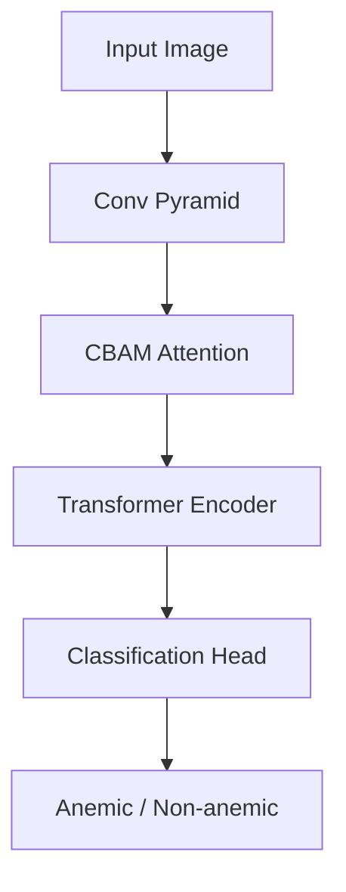

# Model Architecture Documentation

## Problem Overview
Anemia is a condition characterized by a deficiency of red blood cells or hemoglobin, leading to reduced oxygen flow to the body's organs. This project proposes a non-invasive, accessible approach for anemia detection by analyzing conjunctival or nail pallor through smartphone-captured fingernail images.

## Data Pipeline
- **Dataset Size**: 4,260 images (2,521 Anemic + 1,739 Non-anemic).
- **Preprocessing**: Contrast Limited Adaptive Histogram Equalization (CLAHE) is applied to enhance local contrast and highlight relevant pallor features.
- **Augmentation**: Standard transformations including rotation, flipping (horizontal and vertical), and color jitter (brightness, contrast, saturation, hue) to ensure model robustness.

## Model 1 — DeiT Classifier
A Data-efficient Image Transformer (DeiT) is utilized as the baseline transformer model.
- **Backbone**: `deit_base_patch16_224` (transfer learning via pre-trained weights).
- **Fine-tuning Strategy**: The final classification head is replaced to output 2 classes (Anemic vs Non-anemic).

## Model 2 — Hybrid CNN-ViT-Biomarker
A fusion model extracting local and global features, enhanced by domain-specific biomarkers.
- **CNN Backbone**: MobileNetV2 for lightweight local feature extraction.
- **Attention**: Multi-head attention mechanisms to focus on specific regions of the nail.
- **Biomarker**: Integration of an Erythema Index calculation to directly quantify redness/pallor.

## Model 3 — Pyramid-CBAM-Transformer
An advanced architecture combining multiscale processing with spatial/channel attention.
- **Conv Pyramid**: Hierarchical feature extraction at different scales (`[64, 128, 256]` channels).
- **CBAM Attention**: Convolutional Block Attention Module to independently refine features across channel and spatial dimensions.
- **Transformer Encoder**: Captures long-range dependencies across the refined multiscale feature maps.

## Training Strategy
- **Sampling**: Class-balanced sampling or weighted loss to address the 2521/1739 imbalance.
- **Optimizer**: AdamW optimizer with a base learning rate of 3.0e-5 and weight decay of 0.05.
- **Scheduling**: ReduceLROnPlateau to adaptively lower the learning rate when validation loss plateaus.
- **Early Stopping**: Patience of 5 epochs to prevent overfitting.

## Evaluation Metrics
- **Accuracy**: Overall correctness of the model.
- **AUROC**: Area Under the Receiver Operating Characteristic curve.
- **F1-Score**: Harmonic mean of precision and recall.
- **Sensitivity/Specificity**: Crucial for medical context. High sensitivity ensures anemic patients are not missed, while high specificity reduces false alarms.

## Deployment
- **TFLite Export**: Models are optimized and quantized to `.tflite` format for edge deployment (e.g., mobile applications).
- **ONNX Export**: Cross-platform `.onnx` export for versatile inference across different hardware targets.
